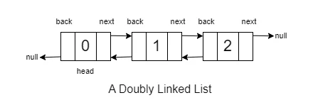

# Doubly Linked Lists

**Doubly Linked Lists**: In this, each node points to both the next node and the previous node, thus allowing it for bidirectional connectivity.



## Defining a Doubly Linked List

[Defining Doubly Linked List](./Intro.md#doubly-linked-list)

## Removing Head from Doubly Linked List

Given linked list: `1 2 11 12 20`

### Objective

Remove the head from the linked list, and if the list is not empty, set the new head as the next node.

### Approach

#### 1. Check if the Linked List is Empty or it has only one element

```cpp
#include<bits/stdc++.h>
using namespace std;

Node* removeHeadFromDll(Node* head) {
    if (head == NULL || head->next == nullptr) {
        return nullptr;
    }
}
```

Here, we start by checking if the linked list is empty (`head == NULL`) or linked list has only one element (`head->next == nullptr`). If it is empty, we return nullptr.

#### 2. Temporarily Store the Head

```cpp
Node* removeHeadFromDll(Node* head) {
    if (head == NULL || head->next == nullptr) {
        return nullptr;
    }
    Node* temp = head;
}
```

If the linked list is not empty, we proceed by storing the current head in a temporary variable (`temp`).

#### 3. Update Head and Delete the Previous Head

```cpp
Node* removeHeadFromDll(Node* head) {
    if (head == NULL || head->next == nullptr) {
        return nullptr;
    }
    Node* temp = head;
    head = head->next;
    temp->next = nullptr;
    head->prev = nullptr;
    delete temp;
    return head;
}
```  

Next, we update the head to point to the next node (`head = head->next`) and delete both next and prev the link from the previous head using `delete temp`. Finally, we return the updated head.

### Conclusion

```cpp
Node* removeHeadFromDll(Node* head) {
    if (head == NULL || head->next == nullptr) {
        return nullptr;
    }
    Node* temp = head;
    head = head->next;
    temp->next = nullptr;
    head->prev = nullptr;
    delete temp;
    return head;
}

int main() {
    vector<int> arr = {1, 2, 11, 12, 20};
    Node* head = arrayToDll(arr); // This function converts array to doubly linked list and returns its head
    return 0;
}
```  

## Removing Tail from Doubly Linked List

Given linked list: `1 2 11 12 20`

### Objective

Remove the tail from the linked list.

### Approach

#### Check if the Linked List is Empty or it has only one element

```cpp
#include<bits/stdc++.h>
using namespace std;

Node* removeHeadFromDll(Node* head) {
    if (head == NULL || head->next == nullptr) {
        return nullptr;
    }
}
```

Here, we start by checking if the linked list is empty (`head == NULL`) or linked list has only one element (`head->next == nullptr`). If it is empty, we return nullptr.

#### Traverse to the Tail

```cpp
Node* temp = head;
while (temp->next != nullptr) {
    temp = temp->next;
}
Node* newTail = NULL;
newTail = temp->prev;
temp->prev = nullptr;
newTail->next = nullptr;
delete temp;
```

After reaching the tail, store it in a temp variable. Then create a new Node called `newNode` and store the `temp->prev` in `newNode`, and then separate a link from `temp->prev` and `newTail->next` to `nullptr`.

### Conclusion

```cpp
Node* removeTailfromDll(Node* head) {
    if (head == NULL || head->next == nullptr) {
        return nullptr;
    }
    Node* temp = head;
    while (temp->next != nullptr) {
        temp = temp->next;
    }
    Node* newTail = temp->prev;
    temp->prev = nullptr;
    newTail->next = nullptr;
    delete temp;
    return head;
}
```

Certainly! Let's go through each section, explaining the purpose and functionality of the provided code:

### Removing Kth element from Doubly Linked List

Given linked list: `1 2 11 12 20`

#### Objective

Remove the Kth element from the linked list.

#### Approach

```cpp
Node* removeKthele(Node* head, int k) {
    if (head == NULL) {
        return nullptr;
    }
    if (k == 1) {
        return removeHeadFromDll(head);
    }

    int ctr = 0;
    Node* temp = head;
    while (temp->next != NULL) {
        ctr++;
        if (ctr == k) break;
        temp = temp->next;
    }

    Node* prevNode = temp->prev;
    Node* newNode = new Node(val, prevNode, temp);
    prevNode->next = newNode;
    temp->prev = newNode;

    return head;
}
```

#### Explanation

- The function `removeKthele` removes the Kth element from the doubly linked list.
- It first checks if the list is empty. If so, it returns nullptr.
- If `k` is 1, it calls `removeHeadFromDll` to remove the head element.
- Otherwise, it traverses the list to find the Kth element and inserts a new node in its place.

### Insert at head of Doubly Linked List

```cpp
Node* insertAtHead(Node* head, int val) {
    if (head == NULL) {
        return new Node(val);
    }
    NodeD* temp = head;
    NodeD* newhead = new Node(val);
    newhead->next = temp;
    temp->prev = newhead;
    return newhead;
}
```

#### Explanation

- The function `insertAtHead` inserts a new node with the given value at the beginning of the doubly linked list.
- If the list is empty (`head == NULL`), it creates a new node and returns it as the new head.
- Otherwise, it creates a new node, sets its `next` to the current head, updates the previous pointer of the current head, and returns the new head.

### Insert at tail of Doubly Linked List

```cpp
Node* insertAtTail(Node* head, int val) {
    if (head == NULL) {
        return new NodeD(val);
    }
    NodeD* temp = head;
    while (temp->next != nullptr) {
        temp = temp->next;
    }
    NodeD* newTail = new NodeD(val);
    newTail->prev = temp;
    temp->next = newTail;
    return head;
}
```

#### Explanation

- The function `insertAtTail` inserts a new node with the given value at the end of the doubly linked list.
- If the list is empty (`head == NULL`), it creates a new node and returns it as the new head.
- Otherwise, it traverses the list to find the current tail, creates a new node, updates the pointers, and returns the original head.

### Insert at Kth element

```cpp
Node* insertAtK(Node* head, int val, int k) {
    if (head == NULL) {
        return nullptr;
    }
    if (k == 1) {
        return insertAtHead(head, val);
    }

    int ctr = 0;
    Node* temp = head;
    while (temp->next != NULL) {
        ctr++;
        if (ctr == k) break;
        temp = temp->next;
    }

    Node* prevNode = temp->prev;
    Node* newNode = new Node(val, prevNode, temp);
    prevNode->next = newNode;
    temp->prev = newNode;

    return head;
}
```

#### Explanation

- The function `insertAtK` inserts a new node with the given value at the Kth position in the doubly linked list.
- If the list is empty (`head == NULL`), it returns nullptr.
- If `k` is 1, it calls `insertAtHead` to insert at the beginning.
- Otherwise, it traverses the list to find the Kth position, inserts a new node, and updates the pointers.

This code provides basic functionality for modifying a doubly linked list at different positions. You can customize these functions based on specific requirements or edge cases.