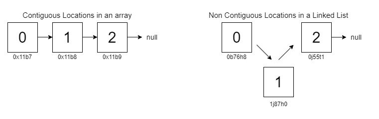
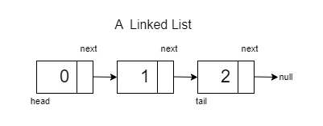
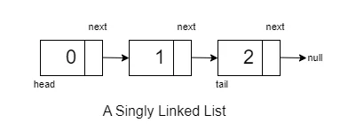
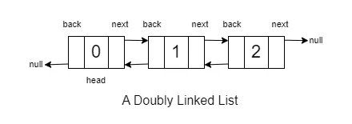
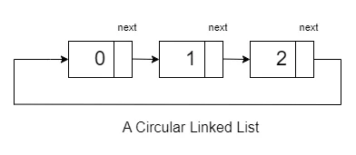

# Linked List

A linked list is a linear data structure that can be visualized as a chain with different nodes connected, where each node represents a different element. The key distinction between arrays and linked lists is that, unlike arrays, the elements in a linked list are not stored at contiguous memory locations.

Since for any element to be added in an array, we need the exact next memory location to be empty, and it is impossible to guarantee that it is possible. Hence adding elements to an array is not possible after the initial assignment of size.



In arrays, to add an element, you need an exact next memory location to be empty, and it is impossible to guarantee this condition. Consequently, adding elements to an array is not possible after the initial assignment of size.




A linked list is a data structure containing two crucial pieces of information, the first being the data and the other being the pointer to the next element. The ‘head’ is the first node, and the ‘tail’ is the last node in a linked list.


## Types of Linked Lists:

## Singly Linked Lists

**Singly Linked Lists**: In a singly linked list, each node points to the next node in the sequence. Traversal is straightforward but limited to moving in one direction, from the head to the tail.



### Creating a Singly Linked List

There are two information sets to store at every node, thus there is a need to create a self-defined data type to handle them. 

```cpp
#include<bits/stdc++.h>
using namespace std;

class Node
{
    /* data */

    public:  //access Modifier
    int data; // the data value
    Node* next; // the pointer to the next value

    Node(int value,Node*nextptr)  
    {
        data = value; // Initialize data with the provided value
        next = nextptr; // Initialize next with the provided value
    }
    Node(int value) 
    {
        data = value; // Initialize data with the provided value
        next = nullptr; // Initialize next as null since it's the end of the list
    }

};

int main() {
    vector<int> arr = { 1,2,11,12};

    Node * x = new Node(arr[1]);
    cout<<x<<'\n';  // Return memory address of x 
    cout<<x->data<<'\n'; // Returns the data stored at that memory point 
    

return 0;
}
```
```
    Output : 0xcc16a8 
    Output : 2
```
## Doubly Linked List

**Doubly Linked Lists**: In this each node points to both the next node and the previous node, thus allowing it for bidirectional connectivity.


<a name="DLL">
</a>
### Creating a Doubly Linked List

```cpp
class Node{
    public:
    
    int data;
    Node*perv;
    Node*next;

    Node(int value,Node*prevptr,Node*nextptr){
        data = value;
        prev = prevptr;
        next =nextptr;
    }

    Node(int value){
        data = value;
        prev = nullptr;
        next = nullptr;
    }
};

int main(){
     vector<int> arr = { 1,2,11,12};

     Node * x = new Node(arr[1]);
    
     cout<<x;

     cout<<x->data;

     return 0;
}
```


**Circular Linked Lists**: In a circular linked list, the last node points back to the head node, forming a closed loop.


