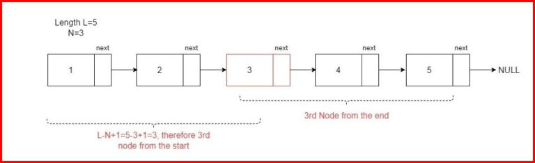
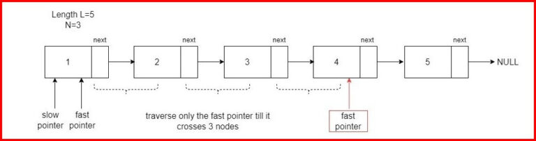

# Remove Nth Node from End of Linked List

Given a singly linked list, the task is to remove the nth node from the end of the list.


## Explanation and Dry Run

### Brute Force Approach:


1. Calculate the length of the linked list.
2. Identify the position of the node to be removed (positionToRemove = length - k).
3. Move to the node just before the one to be removed.
4. Remove the node.

### Optimized Approach:

1. Move the fast pointer k nodes ahead.
2. Move both pointers until the fast pointer reaches the end.
3. Remove the nth node from the end.

### Example:

Given linked list: 1 -> 2 -> 3 -> 4 -> 5 -> 6, and k = 2

Brute Force Result: 1 -> 2 -> 3 -> 4 -> 6

Optimized Result: 1 -> 2 -> 3 -> 5 -> 6

## Brute Force Approach

```cpp
Node* removeNthFromEnd(Node* head, int k) {
    Node* temp = head;
    int length = 0;

    // Calculate the length of the linked list
    while (temp) {
        length++;
        temp = temp->next;
    }

    int positionToRemove = length - k;

    // Move to the node just before the one to be removed
    temp = head;
    for (int i = 0; i < positionToRemove - 1; i++) {
        temp = temp->next;
    }

    // Remove the node
    Node* toRemove = temp->next;
    temp->next = temp->next->next;
    delete toRemove;

    return head;
}
```

### Optimized Approach

```cpp
Node* removeNthFromEnd(Node* head, int k) {
    Node* fast = head;
    Node* slow = head;

    // Move the fast pointer k nodes ahead
    for (int i = 0; i < k; i++) {
        fast = fast->next;
    }

    // Move both pointers until the fast pointer reaches the end
    while (fast->next != NULL) {
        fast = fast->next;
        slow = slow->next;
    }

    // Remove the nth node from the end
    Node* toRemove = slow->next;
    slow->next = slow->next->next;
    delete toRemove;

    return head;
}
```
### Time and Space Complexity Analysis

#### Brute Force Approach:

- **Time Complexity:**
  - Calculating the length of the linked list: O(n)
  - Moving to the node just before the one to be removed: O(k)
  - Removing the node: O(1)
  - Overall time complexity: O(n + k)

- **Space Complexity:**
  - Only a constant amount of extra space is used.
  - Space complexity: O(1)

#### Optimized Approach:

- **Time Complexity:**
  - Moving the fast pointer k nodes ahead: O(k)
  - Moving both pointers until the fast pointer reaches the end: O(n - k)
  - Removing the node: O(1)
  - Overall time complexity: O(n - k)

- **Space Complexity:**
  - Only a constant amount of extra space is used.
  - Space complexity: O(1)
