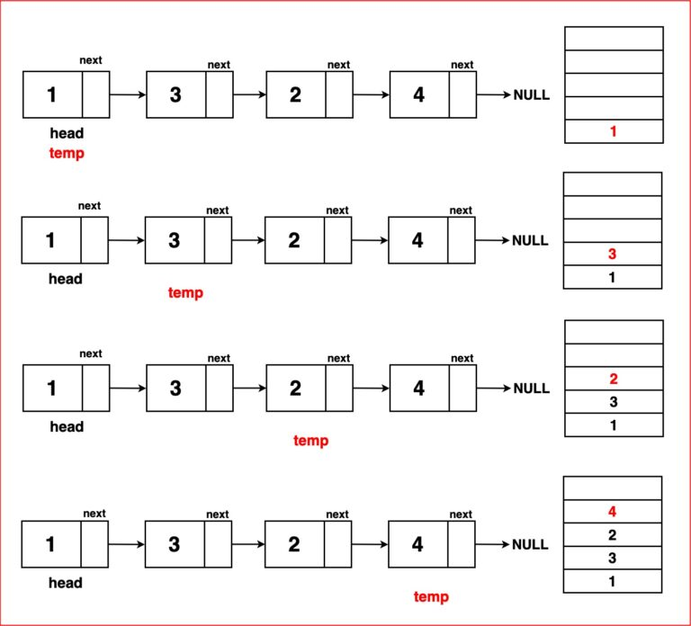
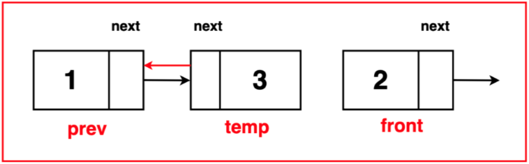

# Reverse a Singly Linked List

## Approach 1: Data Replacement

In this approach, we use a stack to temporarily store the data of each node in the linked list. After storing the data in the stack, we pop the elements from the stack and replace the data in the linked list.

```cpp
Node* reverseWithDataReplacement(Node* head) {
    Node* temp = head;
    std::stack<int> st;

    while (temp) {
        st.push(temp->data);
        temp = temp->next;
    }

    temp = head;
    while (temp) {
        temp->data = st.top();
        st.pop();
        temp = temp->next;
    }

    return head;
}
```

**Step 1:** Create an empty stack. This stack will be used to temporarily store the nodes from the original linked list as we traverse it.

**Step 2:** Traverse the linked list using a temporary variable `temp` till it reaches null. At each node, push the value at the current node onto the stack.



**Step 3:** Set variable `temp` back to the head of the linked list. While the stack is not empty, set the value at the temp node to the value at the top of the stack. Pop the stack and move temp to the next node till it reaches null.


**Step 4:** Return the head as the new head of the reversed linked list.

## Approach 2: Iterative Approach

In this approach, we reverse the linked list by changing the direction of the pointers iteratively.

```cpp
Node* reverseIteratively(Node* head) {
    Node* back = nullptr;
    Node* temp = head;

    while (temp) {
        Node* front = temp->next;
        temp->next = back;
        back = temp;
        temp = front;
    }

    return back;
}
```

**Step 1:** Initialise a ‘temp’ pointer at the head of the linked list. This pointer will be used to traverse the linked list. And initialize the pointer ‘prev’ to ‘NULL’ to keep track of the previous node. This will be used to reverse the direction of the ‘next’ pointers.


**Step 2:** Traverse the entire linked list by moving through each node using the ‘temp’ pointer until it reaches the end (marked as ‘NULL’).

At each iteration within the traversal,

- Save the reference to the next node that ‘temp’ is pointing to in a variable called ‘front’. This helps retain the link to the subsequent node before altering the ‘next’ pointer.



- Reverse the direction of the ‘next’ pointer of the current node (pointed to by ‘temp’) to point to the ‘prev’ node. This effectively reversed the direction of the linked list, making the current node point to the previous node.


- Move the ‘prev’ pointer to the current node. This sets up the ‘prev’ pointer for the next iteration of the loop.
- Move the ‘temp’ pointer to the ‘front’ node. This advances the traversal to the next node in the original order.

In summary:

**Step 3:** Keep traversing through the linked list using the ‘temp’ pointer until it reaches the end, thereby reversing the entire list. Once the ‘temp’ pointer reaches the end, return the new head of the reversed linked list, which is now indicated by the ‘prev’ pointer. This ‘prev’ pointer becomes the first node in the newly reversed list.

## Approach 3: Recursive Approach

In the recursive approach, we reverse the rest of the linked list recursively and then modify the pointers accordingly.

```cpp
Node* reverseRecursively(Node* head) {
    if (head == nullptr || head->next == nullptr) {
        return head;
    }

    Node* newHead = reverseRecursively(head->next);
    Node* front = head->next;
    front->next = head;
    head->next = nullptr;

    return newHead;
}
```

**Base Case:**
Check if the linked list is empty or contains only one node. Return the head as it’s already reversed in these cases.


**Recursive Function:**
The core of the algorithm lies in implementing a recursive function responsible for reversing the linked list. This function operates based on the following principle:

If the base case conditions are not met, the function invokes itself recursively. This recursion continues until it reaches the base case, gradually reversing the linked list starting from the second node (node after it) onward.


**Return:**
Following the recursion, the function returns the new head of the reversed linked list. This head marks the last node of the original list before reversal, now the first node in the reversed sequence.


**Steps:**

**Step 1:** Establish Base Case Conditions: Check if the linked list is either empty or contains only one node. If so, the list is already reversed; hence, return the head as is.

**Step 2:** Recursively Reverse the List: Begin the recursive step by reversing the linked list, starting from the second node. Utilise a recursive call to the reverse linked list function, passing the next node as an argument.


**Step 3:** Preserve Access to Remaining Nodes: To maintain access to the rest of the linked list while reversing the order, store a reference to the node following the current ‘head’ node. This step ensures continuity in the link sequence during reversal.

**Step 4:** Reverse Link Direction: Adjust the ‘front’ node to point to the current ‘head’ node in the reversed order. This action effectively reverses the link between the ‘head’ node and the ‘front’ node.

**Step 5:** Prevent Cyclic References: Break the link from the current ‘head’ node to the ‘front’ node to prevent any cyclic formations. Set ‘head->next’ to ‘NULL’ to ensure the reversed segment of the list does not create a loop.

**Step 6:** Return the New Head: Finally, return the ‘newHead,’ which signifies the new head of the reversed linked list. This ‘newHead’ was initially the last node in the list before the reversal commenced.

## Example

### Input
1 -> 2 -> 3 -> 4 -> 5 -> NULL

### Output (using each approach)
#### Approach 1
5 -> 4 -> 3 -> 2 -> 1 -> NULL

#### Approach 2
5 -> 4 -> 3 -> 2 -> 1 -> NULL

#### Approach 3
5 -> 4 -> 3 -> 2 -> 1 -> NULL
