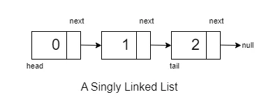

# Singly Linked List Operations

**Singly Linked Lists**: In a singly linked list, each node points to the next node in the sequence. Traversal is straightforward but limited to moving in one direction, from the head to the tail.


## Removing Head from Singly Linked List

Given linked list: `1 2 11 12 20`

### Objective
Remove the head from the linked list, and if the list is not empty, set the new head as the next node.

### Approach

#### 1. Check if the Linked List is Empty
```cpp
Node* RemoveHead(Node* head){
    if(head == NULL) return nullptr;
}
```
Here, we start by checking if the linked list is empty (`head == NULL`). If it is empty, we return the head as it is.

#### 2. Temporarily Store the Head
```cpp
Node* RemoveHead(Node* head){
    if(head == NULL) return head;

    Node* temp = head;
```
If the linked list is not empty, we proceed by storing the current head in a temporary variable (`temp`).

#### 3. Update Head and Delete the Previous Head

```cpp
    head = head->next;
    delete temp;

    return head;
}
```
Next, we update the head to point to the next node (`head = head->next`) and delete the previous head using `delete temp`. Finally, we return the updated head.

### Conclusion
By following these steps, the head is successfully removed from the linked list, and the new head becomes the node that was next to the removed head.

## Removing Tail from Singly Linked List

Given linked list: `1 2 11 12 20`

### Objective
Remove the tail from the linked list.

### Approach

#### Traverse to the Node Before the Tail
```cpp
temp->next->next = nullptr{
    temp = temp->next;
}
```
To remove the tail, traverse until the node before the tail and set its `next` pointer to `nullptr`.

#### Delete the Tail Node
```cpp
delete temp->next;
temp->next = nullptr;
```
After reaching the node before the tail, delete the tail node and set its `next` pointer to `nullptr`.

### Conclusion
This process successfully removes the tail from the linked list.

## Removing Kth Element from Linked List

Given linked list: `1 2 11 12 20`

### Objective
Remove the Kth element from the linked list.

### Approach

#### Check for Edge Cases
```cpp
if(head->next == NULL) return head;

if(k == 1){
    Node* temp = head;
    head = head->next;
    delete temp;
    return head;
}
```
Check if the linked list is empty or if the Kth element is the first element.

#### Traverse and Remove Kth Element
```cpp
int ctr = 0;
Node* temp = head; Node* prev = NULL;

while(temp->next != nullptr){
    ctr++;
    if(ctr == k){
        prev->next = prev->next->next;
        free(temp);
        break;
    }
    prev = temp;
    temp = temp->next;
}
```
Traverse the list until the Kth element, update pointers to remove the element, and free the memory.

### Conclusion
This approach successfully removes the Kth element from the linked list.

## Removing a Particular Element from a Linked List

Given linked list: `1 11 12 15 20`

### Objective
Remove a particular element from the linked list.

### Approach

#### Check for Edge Case
```cpp
if(head == NULL) return NULL;
Node* temp = head;

if(head->data == val){
    Node* temp = head;
    head = head->next;
    free(temp);
    return head;
}
```
Check if the linked list is empty or if the element to be removed is the first element.

#### Traverse and Remove Element
```cpp
Node* temp = head; Node* prev = NULL;

while(temp->next != nullptr){
    if(temp->data == val){
        prev->next = prev->next->next;
        free(temp);
        break;
    }
    prev = temp;
    temp = temp->next;
}
```
Traverse the list until the element is found, update pointers to remove the element, and free the memory.

### Conclusion
This approach successfully removes a particular element from the linked list.

## Inserting at Head

Given linked list: `11 12 15 20`

### Objective
Insert a new element at the head of the linked list.

### Approach

#### Check for Edge Case
```cpp
if(head == NULL) return new Node(val);

Node* temp = new Node(val);

temp->next = head;

return temp;
```
Check if the linked list is empty. If it is, create a new node and make it the head.

#### Insert at Head
```cpp
Node* temp = new Node(val);

temp->next = head;

return temp;
```
Create a new node, point its `next` to the current head, and make it the new head.

### Conclusion
This approach successfully inserts a new element at the head of the linked list.

## Inserting at Tail

Given linked list: `11 12 15 20`

### Objective
Insert a new element at the tail of the linked list.

### Approach

#### Check for Edge Case
```cpp
if(head == NULL) return new Node(val);

Node* temp =  head;
```
Check if the linked list is empty. If it is, create a new node and make it the head.

#### Traverse to the Tail
```cpp
while(temp->next != nullptr){
    temp = temp->next;
}
```
Traverse the list until the current node's `next` is `nullptr`, reaching the tail.

#### Insert at Tail
```cpp
Node* newNode = new Node(val);

temp->next = newNode;
newNode->next =  nullptr;

return head;
```
Create a new node, point the current tail's `next` to the new node, and make the new node point to `nullptr`.

### Conclusion
This approach successfully inserts a new element at the tail of the linked list.

## Inserting at Kth Position

Given linked list: `1 2 11 12 20`

### Objective
Insert a new element at the Kth position in the linked list.

### Approach

#### Check for Edge Case
```cpp
if(head == NULL) {
    if(pos == 1){
        return new Node(val);
    }
}
```
Check if the linked list is empty. If it is and the position is `1`, create a new node and make it the head.

#### Traverse to the Kth Position
```cpp
int ctr = 0; Node* temp = head; Node* prev = NULL;
while(temp->next != nullptr){
    ctr++;
    if(ctr == pos-1){
        Node* newNode = new Node(val);
        newNode->next = temp->next;
        temp->next= newNode;
    }

    temp = temp->next;
}
```
Traverse the list until the Kth position, create a new node, and update pointers to insert the new node.

### Conclusion
This approach successfully inserts a new element at the Kth position in the linked list.
