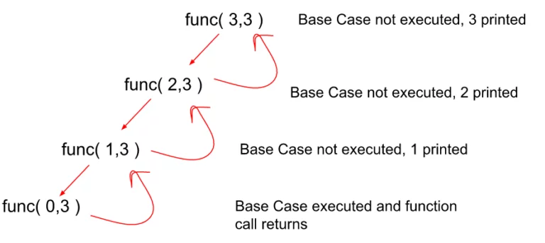

# Recursion with Backtracking 

## Overview

This algorithm utilizes recursion and backtracking to print numbers in descending order. The function `recurssion` takes two parameters, `i` and `n`, and recursively prints numbers from `n` to `i` using backtracking. The goal is to demonstrate the concept of recursion and the application of backtracking in reversing the order of printed numbers.

## Code Implementation

The algorithm is implemented in C++ as follows:

```cpp
#include <iostream>
using namespace std;

void recurssion(int i, int n) {
    // Base Condition: If i exceeds n, return to stop recursion.
    if (i > n)
        return;

    // Recursive call with incremented i
    recurssion(i + 1, n);

    // Backtracking: Print i after returning from recursive calls
    cout << i << endl;
}

int main() {
    // Example: Print numbers from 1 to 5 in descending order
    recurssion(1, 3);

    return 0;
}
```

## Explanation

In this implementation, the key concept is backtracking. The function `recurssion` first makes recursive calls, and after returning from those calls, it backtracks to print the current value of `i`. This backtracking approach results in printing the numbers in descending order.

## Recursive Tree




This tree illustrates the sequence of recursive calls and the backtracking mechanism.

## Usage

To use the provided function, call `recurssion` with the starting index `i` and the desired ending value `n`:

```cpp
int main() {
    // Print numbers from 1 to 5 in descending order
    recurssion(1, 5);

    return 0;
}
```
